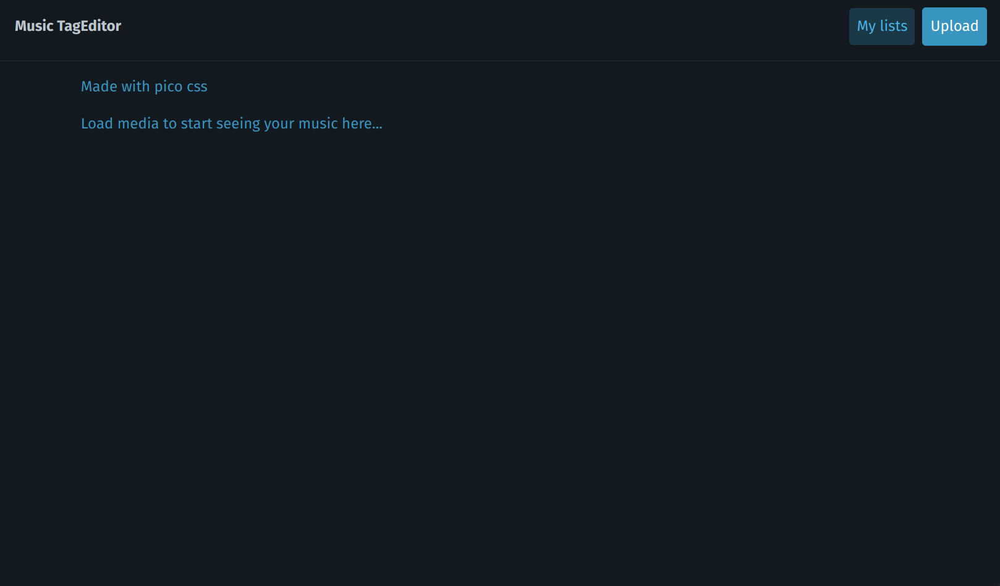
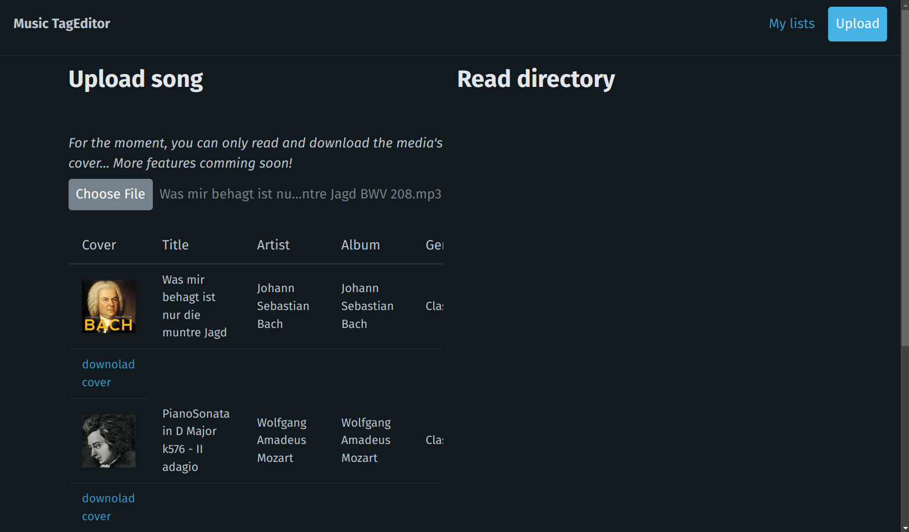
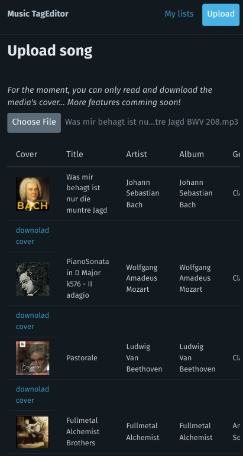

# music-tag-editor
Editor simple de metadata de tus canciones



Lee la metadata de tu musica


Descarga tus covers favoritos


Gracias a PicoCSS el diseno es responsivo


## Project setup
```
npm install
```

### Compiles and hot-reloads for development
```
npm run serve
```

### Compiles and minifies for production
```
npm run build
```

### Lints and fixes files
```
npm run lint
```
### Instalar Picocss
```
npm install @picocss/pico
```

### Import picocss
main.js
```
import '@picocss/pico';
```
### Customize configuration
See [Configuration Reference](https://cli.vuejs.org/config/).
